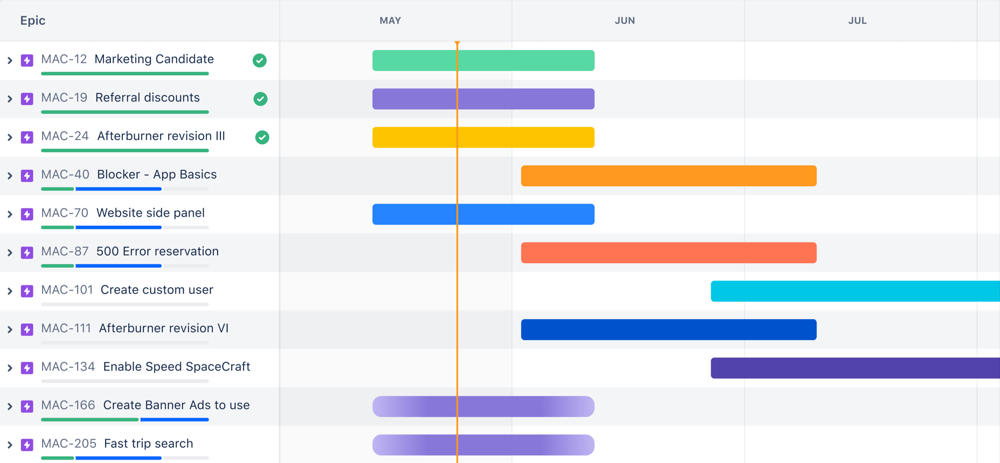
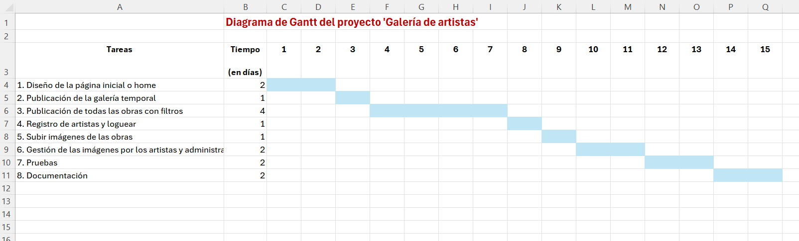
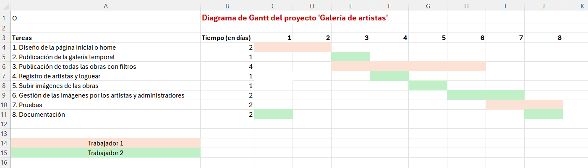

# Diagramas de Gantt

Un **diagrama de Gantt** es una herramienta visual de gestión de proyectos que permite representar gráficamente el cronograma de un proyecto. Fue desarrollado por Henry L. Gantt a principios del siglo XX y es ampliamente utilizado para planificar, coordinar y hacer seguimiento de tareas dentro de un proyecto.

### ¿Qué es un diagrama de Gantt?
El diagrama de Gantt es un gráfico de barras horizontales. En el eje vertical se muestran las tareas o actividades del proyecto, mientras que el eje horizontal representa el tiempo (puede ser en días, semanas, meses, etc.). Cada barra refleja el tiempo que tomará completar una tarea, mostrando claramente el inicio y el fin de cada actividad.

{:class="center"}

### ¿Cuál es su utilidad?
1. **Planificación y organización**: El diagrama permite descomponer el proyecto en tareas individuales, asignar fechas de inicio y fin para cada una y organizarlas de manera visual.
   
2. **Seguimiento del progreso**: Ayuda a monitorizar el progreso de las tareas a lo largo del tiempo. Puedes ver qué tareas ya se han completado, cuáles están en progreso y cuáles están por comenzar.

3. **Identificación de dependencias**: En muchos proyectos, algunas tareas dependen de la finalización de otras. El diagrama de Gantt te permite ver estas dependencias, lo que facilita la programación y evita conflictos.

4. **Asignación de recursos**: Ayuda a asignar personas o recursos a tareas específicas y gestionar la carga de trabajo, asegurando que no haya sobrecargas ni tiempos muertos.

5. **Visión global del proyecto**: Ofrece una visión clara y general del proyecto, mostrando todas las actividades planificadas y el tiempo necesario para completarlas. Esto facilita la comunicación con los equipos de trabajo y las partes interesadas.

### Ejemplo de uso
Imagina que estás gestionando un proyecto para desarrollar una aplicación. Podrías dividir el proyecto en diferentes fases como "Análisis de requisitos", "Diseño", "Desarrollo", "Pruebas" y "Despliegue". El diagrama de Gantt te mostraría el tiempo estimado para cada fase, las tareas dentro de cada fase y cómo se solapan o dependen unas de otras.

### Herramientas comunes para crear diagramas de Gantt
- **Microsoft Project**
- **Trello (con extensiones)**
- **Asana**
- **GanttProject**
- **Monday.com**

### Ventajas
- Visualización clara del cronograma.
- Fácil identificación de problemas o retrasos.
- Mejora la coordinación y la comunicación dentro del equipo.

El uso de un diagrama de Gantt es fundamental en la gestión de proyectos para asegurar que se cumplen los plazos y que todas las partes implicadas están alineadas con el progreso y la planificación del proyecto.

### Ejemplo práctico en Excel
Nos han encargado realizar un programa para una asociación de artistas pintoresque desean publicar sus obras en un sitio web propio. 
La web deberá contener los siguientes apartados:
- En la página inicial se mostrará una presentación del sitio y las últimas novedades.
- Habrá otro apartado donde se publicará una galería temporal con obras seleccionadas de diferentes artistas.
- En otro apartado se mostrará todas las obras del sitio y a las que se les podrá aplicar diferentes filtros para seleccionarlas.
- Por último, se permitirá que se registren nuevos artistas, loguearse, subir imágenes de sus obras y gestionarlas.

Primero vamos a establecer las diferentes tareas que se pueden realizar estableciendo el número de días que se necesitará para realizarlas:
1. Diseño de la página inicial o home -> 2 días
2. Publicación de la galería temporal -> 1 día
3. Publicación de todas las obras con filtros -> 4 días
4. Registro de artistas y loguear -> 1 día
5. Subir imágenes de las obras -> 1 día
6. Gestión de las imágenes por los artistas y administradores -> 2 días
7. Pruebas -> 2 días
8. Documentación -> 2 días

Nota: Hay muchos aspectos que no se han tenido en cuenta para simplificar el ejercicio como la comprobación del tamaño de las imágenes, si hay diferentes tipos de usuarios, cómo se gestiona la galería, etc.

Suponiendo que solamente trabajara una persona, podemos obtener el siguiente diagrama:

{:class="center"}

Mientras que si disponemos de 2 trabajadores, podemos reorganizar el trabajo para repartir las tareas y pasar de tardar 15 días, a realizarlo en 8 días:

{:class="center"}

---

[Diagramas de Gantt en Jira](https://www.atlassian.com/es/agile/project-management/gantt-chart)