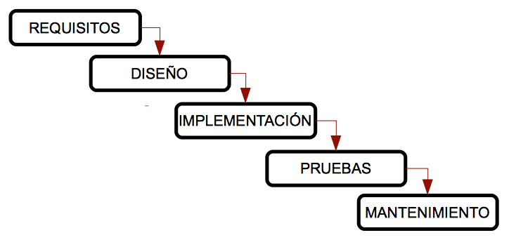
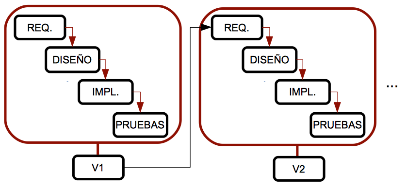

## Ciclos de vida del software

### 1. Ingeniería de software

Para desarrollar software correctamente, debemos seguir una serie de pasos o un enfoque específico para este desarrollo. La **ingeniería de software** es la rama de la informática que nos ayuda a seguir estos enfoques y pasos de manera adecuada.

#### 1.1. Etapas del desarrollo de software

En (casi) todos los procesos de ingeniería de software, podemos seguir estos pasos:

1. **Análisis de requisitos**: esta etapa incluye la comunicación con el cliente para aclarar sus necesidades y un análisis preliminar para delinear el comportamiento principal de la aplicación. Se puede dividir en dos fases:
    - **Especificación de requisitos**: comunicación con el cliente, en la cual se realizarán entrevistas u otros métodos de obtención de información. Se deben aclarar las necesidades a cumplir, y una vez recopilados los requisitos, se redacta un documento llamado _especificación de requisitos_, que debe ser lo más completo posible.
    - **Análisis**: a partir del documento de especificación de requisitos, se elabora un nuevo documento con diagramas que representen las principales funcionalidades de la aplicación y sus conexiones o dependencias.
2. **Diseño**: con los documentos de análisis previos, determinamos cómo funcionará el software. Se utilizan otros diagramas para ayudar en la implementación del software.
3. **Implementación**: esta fase se inicia a partir del diseño, utilizando un lenguaje de programación específico (o varios).
4. **Pruebas**: una vez implementado el producto, se realizan pruebas para verificar que cumple con los requisitos y no presenta errores. Estas pruebas deben ser realizadas por alguien ajeno al proceso de implementación.
5. **Mantenimiento**: esta última fase consiste en mejorar el rendimiento del producto, añadiendo nuevas funcionalidades o corrigiendo errores.

Resumiendo estas etapas, la ingeniería de software nos proporciona un enfoque que nos ayuda a entender el problema a resolver (análisis de requisitos), diseñar una solución posible, implementarla, probarla y luego mejorar su calidad o rendimiento (mantenimiento).

No obstante, estos pasos pueden ser un obstáculo en algunos casos, ya que muchos desarrolladores consideran que la ingeniería de software es demasiado estructurada y no permite desarrollar software rápidamente. Sin embargo, debemos verla como algo adaptable, que ofrece diferentes modelos y metodologías ajustables a nuestro proceso de desarrollo, como veremos más adelante.

### 2. Ciclos de vida del software

Un ciclo de vida es una lista de etapas por las que debe pasar un sistema (en este caso, un proyecto de software) desde su inicio hasta que deja de usarse. En cada ciclo de vida se definen tanto las etapas como los requisitos para pasar de una a otra, incluyendo las entradas y salidas esperadas de cada etapa.

Los productos generados después de cada etapa se llaman _entregables_ y son parte de la entrada de la siguiente fase o una evaluación del proyecto en un punto determinado.

Algunos ciclos de vida son repetitivos, es decir, podemos pasar por la misma etapa más de una vez, dependiendo del estado del producto. Este proceso se conoce como _retroalimentación_.

A continuación, veremos algunos de los ciclos de vida más comunes en el desarrollo de software, con sus ventajas y desventajas. En todos ellos encontraremos las etapas mencionadas (análisis de requisitos, diseño, implementación...), o alguna variación de ellas.

#### 2.1. Modelo en cascada o waterfall

Este es el modelo más antiguo y más extendido. Fue creado por W. Royce en los años 70 y organiza rigurosamente las etapas del desarrollo de software, de manera que una fase no comienza hasta que la anterior ha terminado.

{:class="center"}

Se le llama modelo _cascada_ porque las etapas se sitúan una debajo de la otra, y el proceso fluye de las etapas superiores a las inferiores, como si fuera una cascada.

**Ventajas**:

- Adecuado para proyectos pequeños y bien conocidos, donde los requisitos están perfectamente definidos desde el principio.
- Bien estructurado, las etapas no se mezclan.
- Fácil de usar por su rigidez.

**Desventajas**:

- No se puede aplicar a la mayoría de proyectos reales, ya que los requisitos suelen ser poco conocidos al principio.
- No se ve ningún resultado hasta el final del proceso, lo que puede preocupar a los clientes.
- No es común tener una etapa completamente finalizada antes de comenzar la siguiente.
- Los fallos no se detectan hasta la fase de pruebas, al final del proceso.

**Variaciones**:

Existen algunas variaciones de este modelo, como el **modelo Sashimi**, donde las etapas se solapan, como lo hace el pescado en la cocina japonesa. En este modelo, hay un solapamiento entre dos fases consecutivas, de manera que se empieza la fase de _diseño_ mientras se terminan de definir los requisitos (y se pueden modificar conforme avanzamos con el diseño), y comenzamos la implementación mientras finalizamos el diseño (permitiendo mejorar el diseño ante posibles problemas detectados durante la implementación).

#### 2.2. Modelo en V

Uno de los principales problemas del modelo en cascada es que los fallos no se detectan hasta las fases finales del proceso. En el modelo en V, las pruebas comienzan lo antes posible y se realizan en paralelo por otro equipo de trabajo. De este modo, las pruebas se integran en cada etapa del ciclo de vida.

{:class="center"}

La rama izquierda de la V representa el análisis de requisitos, el diseño y la implementación, y la rama derecha integra las pruebas de cada fase. Nos movemos a lo largo de la rama izquierda hasta llegar al fondo, y luego validamos las pruebas de la rama derecha, desde las más específicas (pruebas unitarias para comprobar módulos concretos del producto) hasta las más generales (pruebas de integración y del sistema). Cada vez que se detecta un problema, volvemos a la fase asociada de la rama izquierda.

**Ventajas**:

- Fácil de usar.
- Se generan entregables para cada etapa.
- Mayor probabilidad de éxito, gracias a los planes de prueba asociados a cada fase.
- Útil para proyectos pequeños con requisitos fáciles de entender.

**Desventajas**:

- También es rígido.
- El usuario no ve ningún resultado hasta las etapas finales, ya que no se desarrollan prototipos intermedios.
- A veces es complicado volver de la rama derecha a la izquierda para corregir problemas.

#### 2.3. Modelo iterativo

Los modelos anteriores solo son adecuados para proyectos con requisitos fáciles y bien especificados, pero esto no es habitual en proyectos de software reales. Para intentar mejorar esto, el modelo iterativo repite el modelo en cascada, generando una versión intermedia o prototipo tras cada iteración. Este prototipo puede ser revisado por el cliente, permitiendo detectar problemas antes y mejorar el sistema.

{:class="center"}

**Ventajas**:

- No es necesario especificar todos los requisitos al principio.
- Los riesgos se gestionan mejor, ya que se entregan prototipos intermedios tras cada iteración.

**Desventajas**:

- Si no especificamos todos los requisitos al principio, pueden surgir más adelante de manera inesperada y afectar significativamente al diseño o la arquitectura del sistema.

**Variaciones**:

Existen algunas variaciones interesantes de este modelo, con otros nombres y algunas características particulares:

- **Modelo incremental**: cada prototipo solo presenta algunas mejoras con respecto al anterior. Esto hace que los prototipos sean más fáciles de probar (solo se prueban los cambios pequeños). Sin embargo, se necesita mucha experiencia para construir estos prototipos de manera proporcional.
- **Modelo basado en prototipos**: se basa en desarrollar prototipos de la aplicación. Al principio, se recopilan algunos requisitos de manera rápida, se realiza un diseño simple y se crea un prototipo básico, para que el cliente pueda revisarlo y dar su opinión. La principal ventaja de este modelo es que el cliente está involucrado desde el principio. Sin embargo, puede ser muy costoso, ya que se pueden desarrollar muchos prototipos inútiles. Además, el cliente puede sentirse decepcionado si revisa versiones del producto que no funcionan como esperaba, y el desarrollador puede verse tentado a acelerar el proceso para incluir todo lo que el cliente desea, eludiendo todos los patrones de calidad y mantenimiento.

#### 2.4. Modelo en espiral

Este modelo fue creado por Boehm en 1988 y trata de combinar los modelos en cascada e iterativo. Las etapas se organizan en una espiral dividida en cuatro secciones, de modo que cada sección realiza una tarea, y cada vuelta de la espiral pasa por todas las secciones, generando un prototipo tras cada vuelta completa.

Este modelo gestiona los riesgos del desarrollo de software. Comenzamos desde el centro de la espiral, y en cada ciclo analizamos todas las alternativas de desarrollo, identificamos los riesgos más asumibles y luego ejecutamos un ciclo de espiral. Si el cliente trae nuevos requisitos o mejoras, evaluamos nuevamente los riesgos y realizamos otro ciclo, hasta que el producto sea finalmente aceptado.

{:class="center"}

- En la etapa de **objetivos**, establecemos el producto final a alcanzar (requisitos, análisis, etc.).
- En la etapa de **evaluación de riesgos**, identificamos los posibles riesgos del proyecto y elegimos las opciones para reducirlos lo máximo posible.
- En la etapa de **implementación y pruebas**, diseñamos, implementamos y probamos el producto, según las opciones elegidas en la etapa anterior.
- En la etapa de **planificación**, revisamos el producto con el cliente y decidimos si necesitamos otro ciclo de espiral para corregir problemas o añadir mejoras.

**Ventajas**:

- Adecuado para proyectos grandes y difíciles.
- Los riesgos se minimizan.
- La implementación y el mantenimiento están integrados.
- Se desarrollan prototipos desde las primeras etapas, lo que permite al cliente dar su opinión a lo largo del proceso.

**Desventajas**:

- Es necesario tener mucha experiencia para evaluar los riesgos correctamente.
- Este modelo genera muchos productos adicionales (informes, prototipos...).
- Puede ser muy costoso.
- No es adecuado para proyectos pequeños.

> **Ejercicio 1:**
> 
> Crea una tabla como la que aparece a continuación (en papel o en un editor de texto) y rellena cada celda con un SÍ o un NO, dependiendo de si la característica especificada forma parte del ciclo de vida correspondiente.

<table> <tr> <th></th> <th>Cascada</th> <th>V</th> <th>Iterativo</th> <th>Espiral</th> </tr> <tr> <td>Es simple y fácil</td> <td></td> <td></td> <td></td> <td></td> </tr> <tr> <td>Genera versiones intermedias del producto</td> <td></td> <td></td> <td></td> <td></td> </tr> <tr> <td>Adecuado para proyectos con requisitos inciertos</td> <td></td> <td></td> <td></td> <td></td> </tr> <tr> <td>Permite evaluar los riesgos de la solución elegida</td> <td></td> <td></td> <td></td> <td></td> </tr> </table>

> **Ejercicio 2:**
> 
> Nuestro equipo va a desarrollar una aplicación para gestionar la contabilidad de una empresa de cines. El cliente aún no tiene claro qué espera de la aplicación y queremos utilizar una tecnología nueva que no controlamos bien. Con esta información, argumenta qué modelo(s) de ciclo de vida son los más adecuados para nuestro propósito, y cuáles NO son recomendables.

> **Ejercicio 3:**
> 
> Un profesor de la Escuela Politécnica Superior de la Universidad de Alicante quiere desarrollar un programa que le ayude a corregir los ejercicios de sus alumnos. Como está muy ocupado, ha pedido a un grupo de antiguos alumnos que lo hagan por él. Suponemos que, como informático, sabe perfectamente lo que quiere desde el principio. Es un proyecto pequeño que no debería llevar mucho tiempo. Con esta información, argumenta qué modelo(s) de ciclo de vida son los más adecuados.