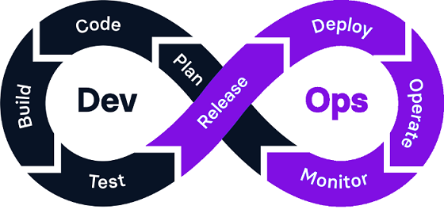

<!-- .slide: data-background="#2C3E50" -->
# DevOps

---

## ¿Qué es DevOps?

El término DevOps proviene de la combinación de los términos "**development**" (desarrollo) y "**operations**" (operaciones), y promueve la coordinación y colaboración de estos dos equipos para ofrecer productos de mejor calidad, más confiables y de forma más rápida.

DevOps implica un conjunto de **prácticas, herramientas y filosofía** que permite **automatizar** e integrar procesos que comparten los equipos de **desarrollo** y de **operaciones**.

---

## Fases del ciclo de vida en DevOps

En DevOps cada fase es continua y se retroalimenta del resto. Se representa mediante un bucle infinito, reflejando la mejora constante.

--

1. **Planificación**: Definir objetivos, requisitos y tareas. Herramientas: Jira, Trello.
2. **Codificación**: Desarrollo del código con control de versiones. Herramientas: GitHub, GitLab.
3. **Construcción**: Compilación del código. Herramientas: Docker, Ansible, Puppet.
4. **Pruebas**: Automatización de pruebas para detectar errores. Herramientas: JUnit, Selenium.
5. **Liberación (Release)**: Entrega de una versión lista para producción.
6. **Despliegue o Implementación**: Envío del software al entorno de producción.
7. **Operaciones**: Gestión de entornos de desarrollo, pruebas, pre-producción y producción.
8. **Monitorización y Retroalimentación**: Uso de herramientas como Grafana y Prometheus.

---

## Las 7Cs de DevOps

1. **Desarrollo continuo (CD)**: Planificación y codificación del software.
2. **Integración continua (CI)**: Código integrado y probado continuamente.
3. **Pruebas continuas**: Automatización de pruebas.
4. **Despliegue continuo**: Implementación automática en producción.
5. **Retroalimentación continua**: Recolección de feedback para mejorar.
6. **Monitorización continua**: Supervisión de aplicaciones y sistemas.
7. **Operaciones continuas**: Mantenimiento de estabilidad y rendimiento.

---

## Herramientas clave de DevOps

- **Control de versiones:** Git, GitLab, Bitbucket.
- **Automatización de CI/CD:** Jenkins, GitLab CI, Travis CI.
- **Infraestructura como código (IaC):** Ansible, Terraform, Chef, Puppet.
- **Contenedores:** Docker, Kubernetes.
- **Monitoreo y análisis:** Prometheus, ELK Stack (Elasticsearch, Logstash, Kibana), Grafana.

---

## Ventajas y desafíos de DevOps

- **Ventajas:**
	- Mayor velocidad de entrega.
	- Mejora en la calidad del software.
	- Colaboración mejorada entre equipos.
	- Reducción de costos.
- **Desafíos:**
	- Cambio cultural necesario.
	- Complejidad en la integración de herramientas.
	- Aumento de la superficie de ataque en la entrega continua (**DevSecOps**).

---

### Debate

¿En qué fases crees que interviene un desarrollador y cómo?  
¿Y un administrador de sistemas?

---

### Vídeo

En el siguiente vídeo puedes ver una explicación sencilla de en qué consiste DevOps.

<iframe width="560" height="315" src="https://www.youtube.com/embed/_I94-tJlovg?si=SrQkGhifcU9DlvY8"" frameborder="0" allowfullscreen></iframe>
