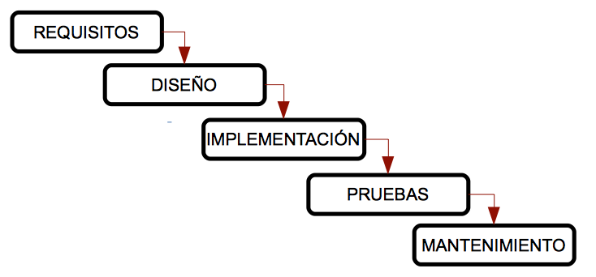
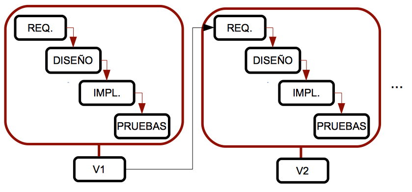
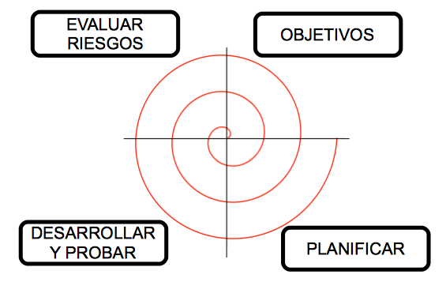

<!-- .slide: data-background="#2C3E50" -->
# Metodologías de software

## Ciclos de vida del software

---

### 1. Ingeniería de software

Para desarrollar software correctamente, debemos seguir una serie de pasos o un enfoque específico. La **ingeniería de software** es la rama de la informática que nos ayuda a seguir estos enfoques y pasos de manera adecuada.

---

### 1.1. Etapas del desarrollo de software

1. **Análisis de requisitos**: incluye la comunicación con el cliente para aclarar sus necesidades y un análisis preliminar para definir el comportamiento de la aplicación. Se divide en:
   * **Especificación de requisitos**: recopilación y aclaración de las necesidades del cliente. El documento resultante se llama *especificación de requisitos*.
   * **Análisis**: creación de diagramas que representen las principales funcionalidades y conexiones de la aplicación.
2. **Diseño**: definición de cómo funcionará el software, basado en los documentos de análisis.
3. **Implementación**: desarrollo del software usando lenguajes de programación.
4. **Pruebas**: comprobación de que el software cumple los requisitos y no presenta errores.
5. **Mantenimiento**: mejoras y corrección de errores tras la implementación.

---

### 2. Ciclos de vida del software

Un ciclo de vida define las etapas que debe seguir un sistema desde su inicio hasta que deja de usarse. Cada etapa tiene entradas, salidas y productos generados, llamados *entregables*.

---

### 2.1. Modelo en cascada

El modelo más antiguo y extendido, creado en los años 70. Las fases deben completarse una tras otra.

--

**Ventajas**:
- Adecuado para proyectos pequeños con requisitos bien definidos.
- Bien estructurado y fácil de usar.

**Desventajas**:
- No aplicable a la mayoría de proyectos reales.
- No se ven resultados hasta el final.
- Los fallos se detectan al final.

---

### 2.2. Modelo en V

Incluye pruebas desde las primeras fases. Las pruebas se realizan en paralelo a las fases de desarrollo.

--

**Ventajas**:
- Fácil de usar.
- Mayor probabilidad de éxito gracias a las pruebas en cada fase.

**Desventajas**:
- También es rígido.
- No se desarrollan prototipos intermedios.

---

### 2.3. Modelo iterativo

Genera versiones intermedias del producto en cada iteración. Útil para proyectos con requisitos poco claros.

--

**Ventajas**:
- No es necesario definir todos los requisitos al inicio.
- Mejora la gestión de riesgos.

**Desventajas**:
- Los requisitos pueden cambiar durante el proceso y afectar al diseño.

---

### 2.4. Modelo en espiral

Combina los modelos en cascada e iterativo. Se gestiona en ciclos, evaluando riesgos en cada ciclo.

{:class="center"}

--

**Ventajas**:
- Adecuado para proyectos grandes y complejos.
- Se minimizan los riesgos.
- El cliente puede revisar prototipos desde las primeras fases.

**Desventajas**:
- Requiere experiencia para gestionar los riesgos.
- Puede ser costoso.

---

<!-- .slide: data-background="#A8DADC" -->
## Ejercicios

### Ejercicio 1

Completa la siguiente tabla indicando si cada característica está presente en cada modelo de ciclo de vida.

### Ejercicio 2

Desarrollar una aplicación para una empresa de cines con requisitos poco claros. ¿Qué modelos son adecuados?

### Ejercicio 3

Un profesor quiere desarrollar una pequeña aplicación con requisitos bien definidos desde el inicio. ¿Qué modelo es adecuado?
