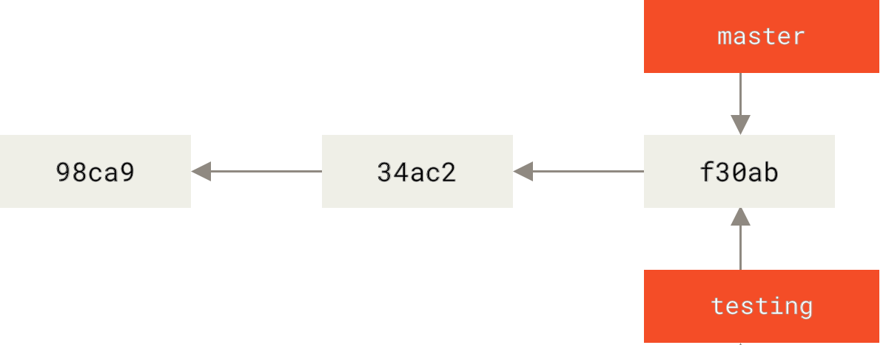
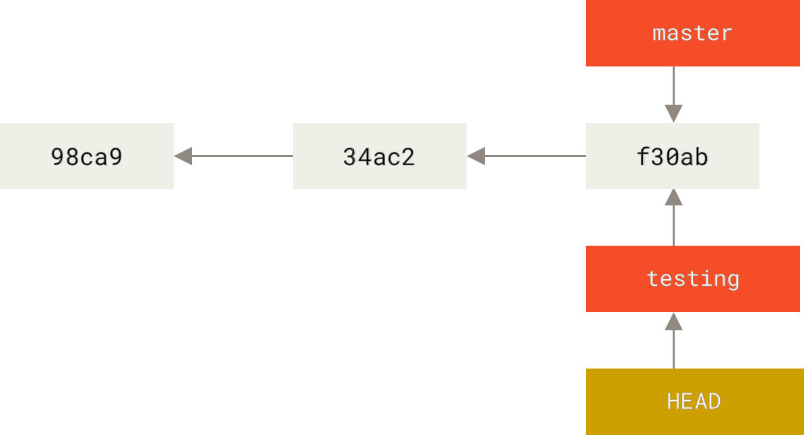
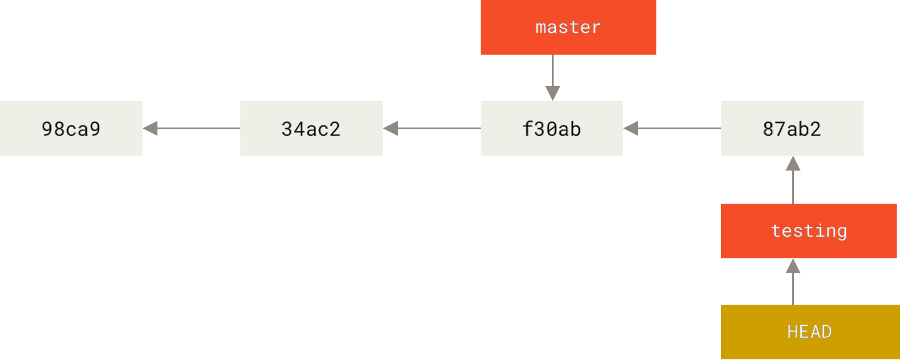
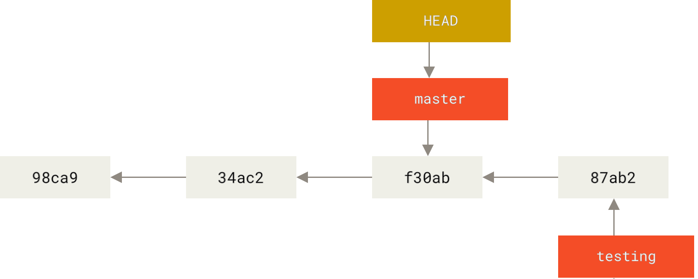
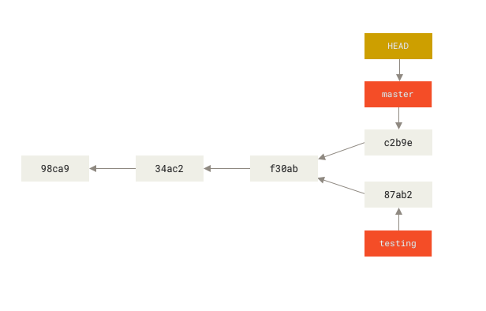

# Herramientas de Control de Versiones

## Ramas en Git


Los Sistemas de Control de Versiones (VCS) generalmente ofrecen algún tipo de soporte para ramas. Las ramas permiten trabajar en múltiples líneas de desarrollo en paralelo. Esto significa que podemos mantener la rama principal estable mientras desarrollamos nuevas características no probadas en ramas separadas.

Tradicionalmente, la ramificación ha sido una operación costosa en muchos VCS, pero la implementación de ramas en Git es extremadamente ligera, haciendo que las operaciones con ramas sean casi instantáneas. Esto hace que cambiar entre ramas sea rápido y sencillo.

Este documento explica los comandos utilizados para crear nuevas ramas locales y fusionar dos ramas.

### 1. Ramas

Como hemos discutido anteriormente, cada commit realizado en Git crea una instantánea.

Una rama en Git es esencialmente un **puntero ligero y movible a uno de estos commits**. El nombre de rama predeterminado en Git solía ser **master**, pero ahora **main** es a menudo el predeterminado en nuevos repositorios. Este cambio es más visible en plataformas como GitHub, donde **main** ha reemplazado a **master** como la rama predeterminada para nuevos proyectos.

Para el resto de este documento, se usará *master* como el nombre de la rama predeterminada por consistencia.

#### 1.1 Creando una Rama

El siguiente comando crea una nueva rama llamada *testing* que apunta al commit actual. Este comando no cambia a la nueva rama *testing*:

```sh
git branch testing
```

Alternativamente, puedes crear y cambiar a una nueva rama en un solo comando:

```sh
git checkout -b testing
```
O, usando el comando más moderno:

```sh
git switch -c testing
```

<div align="center">
	
</div>

#### 1.2 Comprobando la Rama Actual

Para saber en qué rama te encuentras, puedes usar:

```sh
git branch
```
o
```sh
git status
```
o 
```sh
git log --oneline
```

Todos los comandos te dirán la rama actual y mostrarán información adicional útil sobre tu directorio de trabajo.

#### 1.3 Cambiando de Rama

Para cambiar a una rama existente, usa el comando `git checkout`, o el más reciente `git switch`:

```sh
git checkout testing
```
o
```sh
git switch testing
```

Después de ejecutar el comando, el apuntador HEAD se mueve a la rama *testing*.

<div align="center">
	
</div>

Ahora que estás trabajando en la rama *testing*, cualquier nuevo commit moverá el apuntador de la rama *testing* y HEAD al nuevo commit. Entonces, **haz algunos cambios en los archivos y confírmalos**:

```sh
git commit -a -m "nuevo commit"
```

<div align="center">
	
</div>

Observa que la rama *testing* ha avanzado, pero la rama *master* todavía apunta al commit anterior. Cambiemos de nuevo a la rama *master*:

```sh
git checkout master
```
o
```sh
git switch master
```

Como resultado, HEAD apunta de nuevo a *master*, y todos los archivos en tu directorio de trabajo vuelven al estado en que estaban antes de que se creara la rama *testing*. **Cambiar de rama cambia los archivos en tu directorio de trabajo.**

<div align="center">
	
</div>

Ahora puedes **hacer cambios y confirmar** nuevamente en la rama *master*. Tu repositorio Git tendrá dos ramas divergentes.

<div align="center">
	
</div>

Puedes cambiar entre estas ramas según sea necesario y desarrollar cambios de forma independiente. Para ver fácilmente las ramas divergentes, usa el siguiente comando:

```sh
git log --oneline --graph --all
```

Obtendrás una salida similar a esta:

```sh
* c2b9e (HEAD, master) Realizar otros cambios
| * 87ab2 (testing) Hacer un cambio
|/
* f30ab Añadir característica #32 - capacidad de agregar nuevos formatos a la interfaz central
* 34ac2 Corregir error #1328 - desbordamiento de pila en ciertas condiciones
* 98ca9 Commit inicial de mi proyecto
```

#### 1.4 Fusionando Ramas

Una vez que el desarrollo en una rama específica está completo, puedes fusionar los cambios en otra rama. Por ejemplo, para fusionar la rama *testing* en la rama *master*, primero `checkout` a la rama *master*, y luego usa el comando `git merge`:

```sh
git checkout master
git merge testing
```
o, usando el comando moderno:

```sh
git switch master
git merge testing
```

Si las ramas han divergido, Git creará un nuevo commit de fusión con el resultado. Sin embargo, si las ramas pueden avanzar rápidamente (fast-forward), no se creará un nuevo commit, y la rama *master* simplemente avanzará.

**Eliminando Ramas Fusionadas**

Si la fusión fue exitosa, es posible que desees eliminar la rama *testing*, ya que sus cambios ahora son parte de la rama *master*. Usa este comando para eliminar la rama:

```sh
git branch -d testing
```

Este comando no elimina los commits previos, solo elimina el apuntador de la rama. Si la rama no ha sido fusionada y aún quieres eliminarla, puedes forzar la eliminación con:

```sh
git branch -D testing
```

**Conflictos Básicos de Fusión**

A veces surgen conflictos durante las fusiones, especialmente si la misma parte de un archivo ha sido modificada en ambas ramas. Puedes ver algo como esto:

```sh
$ git merge testing
Auto-merging index.html
CONFLICT (content): Merge conflict in index.html
Automatic merge failed; fix conflicts and then commit the result.
```

En este caso, Git no pudo fusionar las ramas automáticamente, por lo que se requiere intervención del usuario. Para ver qué archivos tienen conflictos, ejecuta `git status`. La salida será similar a esta:

```sh
$ git status
On branch master
You have unmerged paths.
(fix conflicts and run "git commit")
Unmerged paths:
(use "git add <file>..." to mark resolution)
both modified: index.html
no changes added to commit (use "git add" and/or "git commit -a")
```

Los archivos con conflictos de fusión se listan como no fusionados. Git añade marcadores de resolución estándar a los archivos en conflicto, que puedes abrir y resolver manualmente. El archivo contendrá una sección como esta:

```html
<<<<< HEAD:index.html
<div id="footer">contacto : email.support@github.com</div>
=======
<div id="footer">
por favor contáctanos en support@github.com
</div>
>>>>> testing:index.html
```

Esto muestra la versión en *HEAD* (tu rama *master*) arriba de la línea `=======` y la versión de la rama *testing* debajo. Para resolver el conflicto, puedes elegir una versión o combinar los cambios. Por ejemplo, podrías resolver el conflicto así:

```html
<div id="footer">
por favor contáctanos en email.support@github.com
</div>
```

Una vez que hayas resuelto todos los conflictos, **ejecuta `git add` en cada archivo para marcarlo como resuelto**, y luego confirma los archivos fusionados. Si necesitas cancelar la fusión por completo, puedes usar:

```sh
git merge --abort
```

#### 1.5 Ramas Remotas

Las ramas locales no se comparten automáticamente con los repositorios remotos. Si estás trabajando de forma privada, no necesitas compartirlas. Sin embargo, si deseas colaborar con otros en una rama específica, tendrás que enviarla al repositorio remoto:

```sh
git push -u <remoto> <rama>
```

Si has usado el comando `clone`, el remoto predeterminado se llama **origin**.

Las versiones modernas de Git a menudo te solicitan establecer la rama upstream automáticamente al enviar una rama por primera vez. Establecer una rama upstream (opción `-u`) asocia tu rama local con una rama en un repositorio remoto, lo que te permite usar `git push` y `git pull` sin tener que especificar el remoto cada vez.

> **Ejercicio 1:**
> Crea un repositorio Git local. Confirma un pequeño archivo de texto. Crea una rama llamada `hotfix` para aplicar algunos cambios, realiza algunos commits en la nueva rama. Finalmente, fusiona la rama en la rama master.
>
> Prueba qué sucede cuando modificas la misma parte de un archivo en diferentes ramas e intentas fusionarlas. Intenta resolver el conflicto.